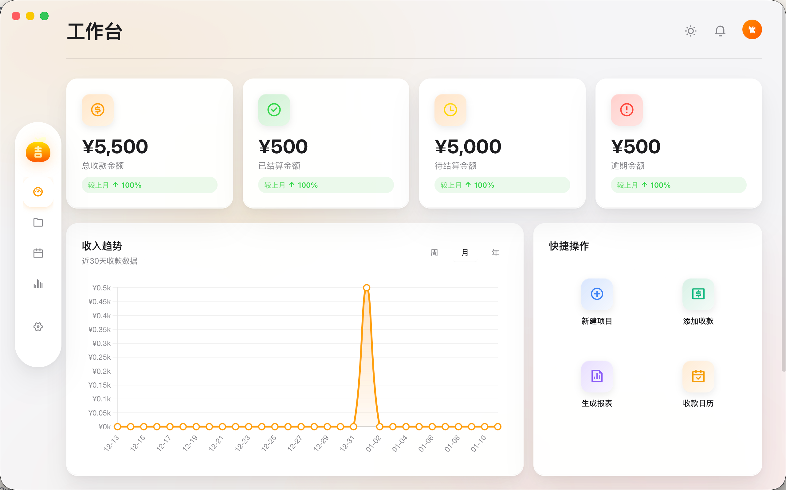
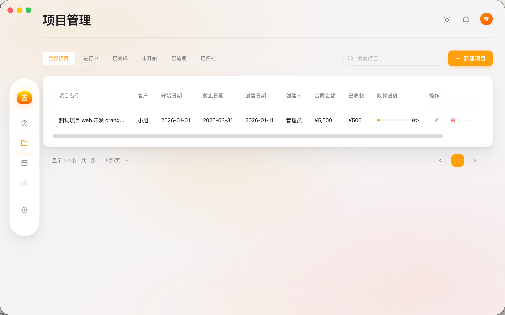
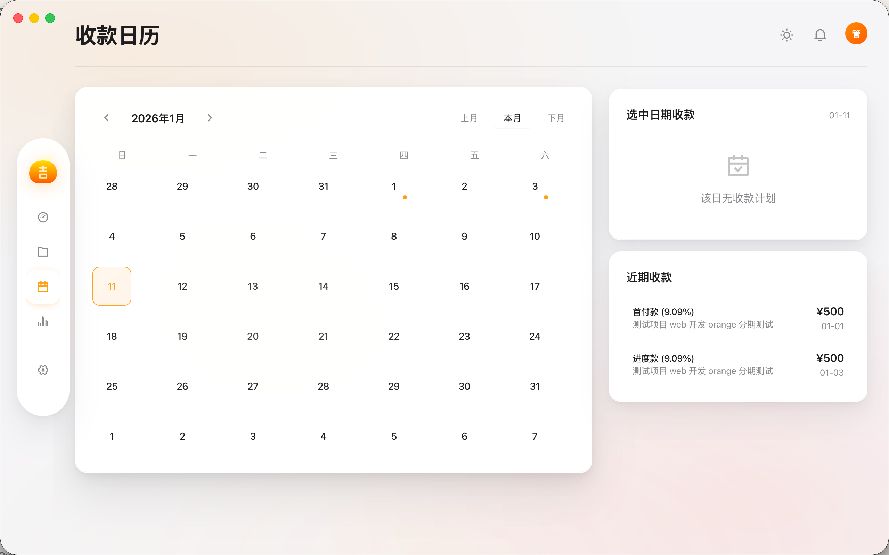
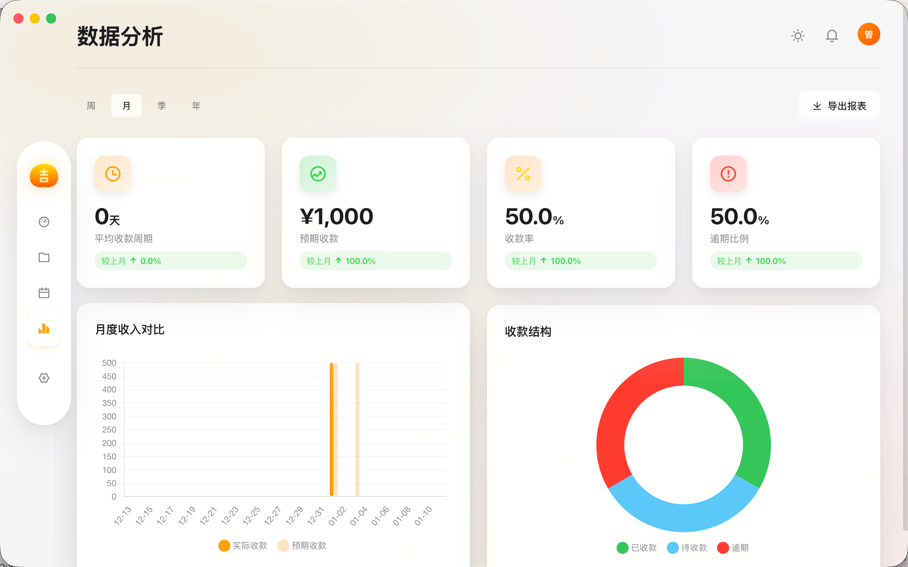
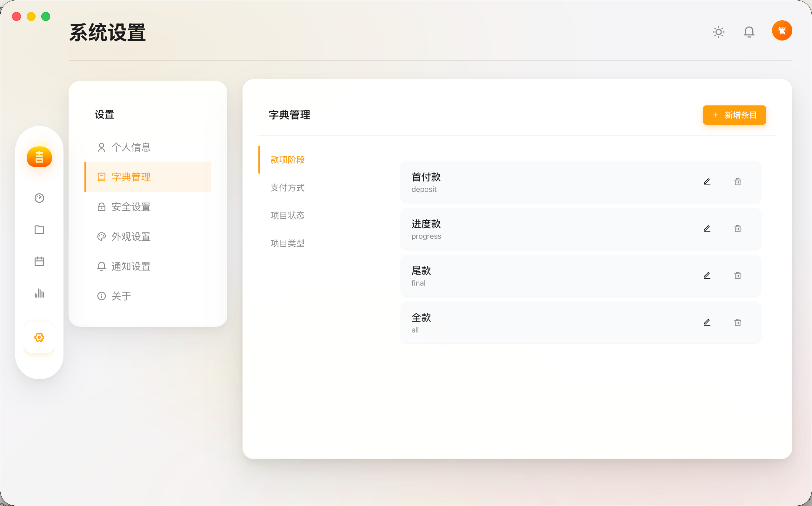
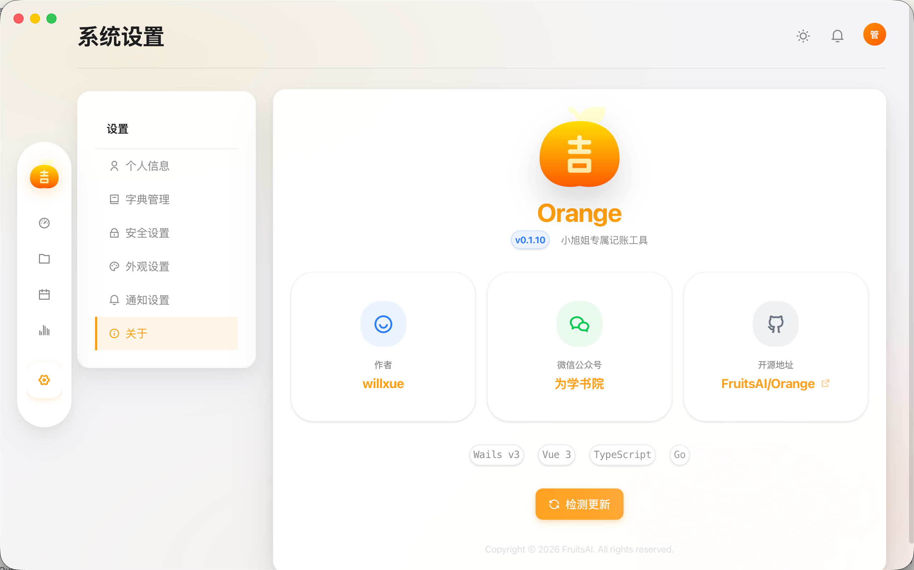

<div align="center">
  

# Orange

  <p>
    <strong>A modern cross-platform desktop application based on Wails v3</strong>
  </p>

  <p>
    <a href="https://wails.io" target="_blank">
      
    </a>
    <a href="https://go.dev" target="_blank">
      
    </a>
    <a href="https://vuejs.org" target="_blank">
      
    </a>
    <a href="https://tailwindcss.com" target="_blank">
      
    </a>
    <a href="./LICENSE">
      
    </a>
  </p>

  <p>
    <a href="./README_EN.md">🇺🇸 English</a> | 
    <a href="./README.md">🇨🇳 简体中文</a>
  </p>
</div>

---

## 📖 Introduction

**Orange** is a modern desktop application built with [Wails v3](https://wails.io), demonstrating how to build high-performance, native-like cross-platform apps using Go (Backend) and Vue 3 (Frontend).

The project integrates a comprehensive suite of business management features, including user permission management, project contract tracking, financial payment management, and system dictionary configuration, aiming to provide best practices for enterprise-level desktop application development.

## ✨ Features

- **Cross-Platform**: Built on Wails v3, runs perfectly on macOS, Windows, and Linux.
- **Modern UI**: Designed with Vue 3 + Tailwind CSS 4.0 and Glassmorphism style, delivering a refined and smooth interface.
- **High Performance Backend**: Powered by Go, integrating Gin Web Framework, GORM ORM, and SQLite database.
- **Secure**: Built-in JWT identity authentication, Bcrypt password hashing, and middleware authorization mechanisms.
- **Complete Business Flow**:
  - 📊 **Dashboard**: Real-time data visualization and statistical analysis.
  - 👥 **User Management**: Includes roles, departments, positions, and multi-credential login support.
  - 🚀 **Project Management**: Full lifecycle management with state transitions and automatic contract number generation.
  - 💰 **Financial Management**: Detailed tracking of payment stages (down payment/progress/final) and overdue reminders.
  - 🔔 **Notifications**: Supports global broadcasts and peer-to-peer private messaging.
  - ⚙️ **System Config**: Flexible dictionary management and version update detection.

## 🛠 Tech Stack

<table>
  <tr>
    <th width="150" align="center">Category</th>
    <th align="left">Technology</th>
  </tr>
  <tr>
    <td align="center"><b>Core</b></td>
    <td><a href="https://wails.io">Wails v3</a> (Alpha)</td>
  </tr>
  <tr>
    <td align="center"><b>Backend (Go)</b></td>
    <td>
      <ul>
        <li><b>Web Framework</b>: <a href="https://github.com/gin-gonic/gin">Gin</a></li>
        <li><b>ORM</b>: <a href="https://gorm.io">GORM</a> (SQLite)</li>
        <li><b>Logging</b>: <a href="https://github.com/uber-go/zap">Zap</a> + Lumberjack</li>
        <li><b>Auth</b>: JWT (golang-jwt/v5)</li>
      </ul>
    </td>
  </tr>
  <tr>
    <td align="center"><b>Frontend (Vue)</b></td>
    <td>
      <ul>
        <li><b>Framework</b>: Vue 3 (Composition API)</li>
        <li><b>Build Tool</b>: Vite 7</li>
        <li><b>Styling</b>: Tailwind CSS 4</li>
        <li><b>State Management</b>: Pinia</li>
        <li><b>Routing</b>: Vue Router 4</li>
        <li><b>Icons</b>: Remix Icon</li>
        <li><b>Charts</b>: Chart.js</li>
      </ul>
    </td>
  </tr>
</table>

## 🚀 Getting Started

### Prerequisites

- **Go**: >= 1.25
- **Node.js**: >= 20
- **NPM**: >= 10

### Installation

1. **Clone the repository**

```bash
git clone https://github.com/FruitsAI/Orange.git
cd Orange
```

2. **Install frontend dependencies**

```bash
cd frontend
npm install
cd ..
```

3. **Run in development mode**

```bash
# This starts the Wails dev server with hot reload support
wails3 dev
```

4. **Build for production**

```bash
wails3 build
```

The build artifacts will be located in the `bin` directory.

### Default Credentials

After the application starts and seeds the database, use the following default admin account to login:

- **Username**: `admin`
- **Password**: `admin123`

## ⚙️ Configuration

The project supports configuration via a `.env` file. You can copy `.env.example` to `.env` and modify it as needed:

```ini
# Database Configuration
# Database Path (Default: orange.db in user config directory)
DB_PATH=orange.db

# JWT Configuration
# JWT Secret (MUST change in production)
JWT_SECRET=orange-secret-key-change-in-production
# Token Expiry (Hours)
TOKEN_EXPIRY=24

# Logger Configuration
# Enable file logging
LOG_ENABLE=true
# Log Level: debug, info, warn, error
LOG_LEVEL=debug
# Log File Path (Default: user config dir/log/orange.log)
LOG_PATH=orange.log
# Max size per log file (MB)
LOG_MAX_SIZE=10
# Max backups to keep
LOG_MAX_BACKUPS=5
# Max age of log files (Days)
LOG_MAX_AGE=30
# Compress old log files
LOG_COMPRESS=true

# GitHub Updates
# Repo for checking updates
GITHUB_REPO=FruitsAI/Orange
```

## 📸 Interface Preview

<div align="center">
<table>
<tr>
<td align="center"><b>Dashboard</b></td>
<td align="center"><b>Projects</b></td>
<td align="center"><b>Calendar</b></td>
</tr>
<tr>
<td></td>
<td></td>
<td></td>
</tr>
<tr>
<td align="center"><b>Analytics</b></td>
<td align="center"><b>Dictionary</b></td>
<td align="center"><b>About</b></td>
</tr>
<tr>
<td></td>
<td></td>
<td></td>
</tr>
</table>
</div>

## 📂 Project Structure

```
Orange/
├── build/              # Wails build config and resources (AppIcon, etc.)
├── cmd/                # Go application entry point
├── frontend/           # Vue 3 frontend source code
│   ├── src/
│   │   ├── components/ # Reusable components
│   │   ├── views/      # Page views
│   │   ├── stores/     # Pinia state stores
│   │   └── ...
├── internal/           # Go backend business logic (private packages)
│   ├── config/         # Configuration loading
│   ├── database/       # Database init and seeding
│   ├── handler/        # HTTP Request Handlers (Controllers)
│   ├── middleware/     # Gin Middleware (Auth, Logger)
│   ├── models/         # GORM Data Models
│   ├── pkg/            # Common utilities (JWT, Response, Logger)
│   ├── repository/     # Data Access Layer (DAO)
│   ├── router/         # Router definitions
│   └── service/        # Business Logic Layer
├── main.go             # Application main entry
├── go.mod              # Go dependencies
└── wails.json          # Wails project config
```

## 🤝 Contributing

Contributions are welcome! Please feel free to submit a Pull Request or open an Issue to improve Orange.

1. Fork the Project
2. Create your Feature Branch (`git checkout -b feature/AmazingFeature`)
3. Commit your Changes (`git commit -m 'Add some AmazingFeature'`)
4. Push to the Branch (`git push origin feature/AmazingFeature`)
5. Open a Pull Request

## 📄 License

This project is licensed under the MIT License. See the [LICENSE](./LICENSE) file for details.
